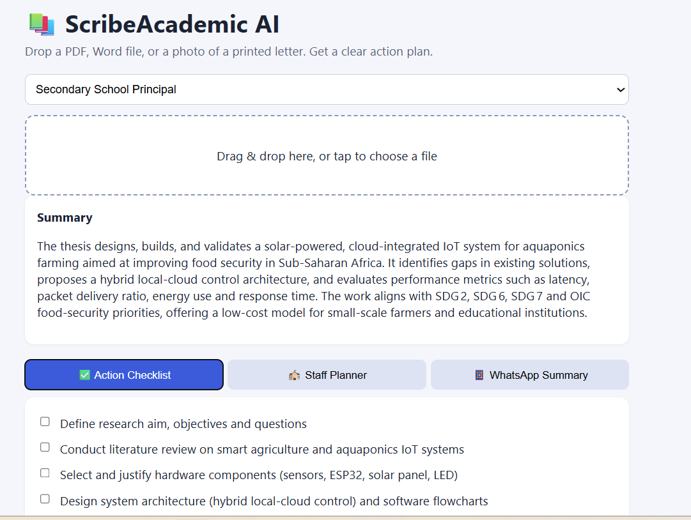

# 📚 ScribeAcademic AI

Turn long education documents into clear action plans in seconds.

**[Live demo](https://scribe-academic-ai.vercel.app)**



## The problem

Schools and universities receive long policy documents, ministry circulars, and printed letters. Staff often have no time to read every page, so important deadlines and duties get missed.

## What it does

Upload a **PDF, Word file, text file, or a photo of a printed letter**, or click **Try a sample document** to see it working in one click. The app reads the document and produces:

- **Action Checklist**: tick-box tasks in date order, with deadlines.
- **Staff Planner**: which department or role must do what.
- **WhatsApp Summary**: a short, emoji-bulleted message you can copy straight into a staff WhatsApp or Telegram group.
- **PDF export**: download the full action plan as a clean PDF.

You can also choose a persona (Principal, Dean, Curriculum Reviewer, Teacher, Registrar) so the output fits the reader.

## How it works

1. The browser reads the file: `pdf.js` for PDFs, `mammoth` for Word, and `tesseract.js` OCR for photos.
2. Only the extracted text is sent to a Next.js API route. This keeps uploads small and fast.
3. The API route asks an AI model (Llama / GPT-OSS on Groq) to return structured JSON.
4. The interface shows the result in three tabs.

## Tech stack

Next.js · React · Groq API · pdf.js · mammoth · tesseract.js · Vercel

## Run it locally

```bash
git clone https://github.com/Alusine-bah/scribe-academic-ai.git
cd scribe-academic-ai
npm install
```

Create a file named `.env.local` and add your free key from [console.groq.com](https://console.groq.com):

```
GROQ_API_KEY=your_key_here
```

Then start the app:

```bash
npm run dev
```

Open http://localhost:3000.

## Limitations

- Only the first ~24,000 characters of a document are analysed.
- OCR works best on clear, well-lit photos in English.
- AI output can contain mistakes. Always check important deadlines against the original document.

## Roadmap

- Support for French and other languages
- Save and share results

## Author

Built by **Alusine Bah**, BSc Electrical & Electronic Engineering, Islamic University of Technology.
[Portfolio](https://alusine-bah.github.io) · [GitHub](https://github.com/Alusine-bah)